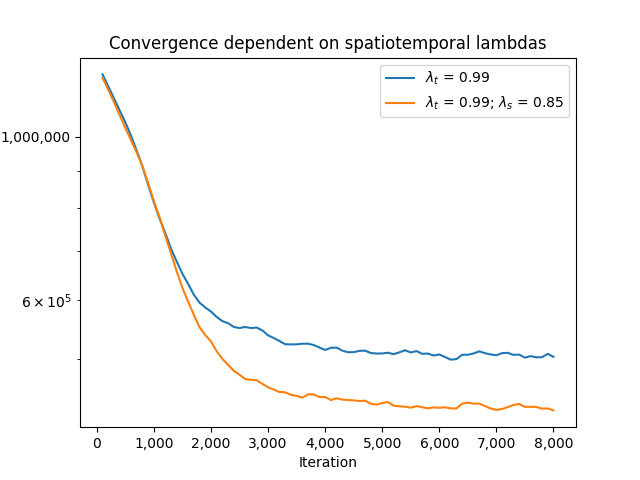

# Spatio-temporal Credit Assignment in Reinforcement Learning for Ultra-Fast Delivery Services

In recent years, customers' demand for online grocery shopping has led to the emergence of ultra-fast on-demand grocery delivery service companies such as Getir, Gorillas, or Flink. These companies promise their customers delivery in around 10 minutes after the order arrives. To fulfill this promise, the companies usually operate multiple micro-warehouses, also called dark stores, in a service region. To further reduce the time to serve orders, a fleet of couriers with e-bikes is used, as these travel faster in urban areas compared to cars. In the problem we dynamically assign orders to warehouses and couriers. We can also reject customers, which comes with certain costs.

Visualization of the problem (made in [visualizeSimulation.py](dataCode/visualizeSimulation.py)):

<p style="text-align:center;">
</p>

To solve the problem, we now have implemented the REINFORCE algorithm. In the REINFORCE method, a crucial part is the credit assignment problem, i.e., the problem to assign credit to a specific action. Naturally, we could just state that an action $a_i$ is the waiting time for customer $i$, i.e., $w_i$. Mathematically, we can express this as:

$$
\begin{align}
C(s_i, a_i) = w_i
\end{align}
$$

where $s_i$ is the state when the $i^{\text{\tiny th}}$ customer arrives. However, this neglects the fact, that an action taken in epoch $i$ has an effect on later actions and consequently, the associated costs. To tackle this issue, we add discounted costs of future customers to the current costs. Also, we only add costs of customers at the same warehouse, i.e, $D_i = D_j$. This cost assignment is possible in training phase, as we can look at the problem retrospectively. We therefore modify the initial cost function as follows: 

$$
\begin{align}
C(s_i, a_i) = w_i + \sum_{j>i \atop{D_i = D_j}} w_j \cdot \lambda_t^{t_j - t_i}
\end{align}
$$

where $\lambda_t$ is a parameter that determines how much future costs weight and $t_j$ ($t_j$) is the time customer $i$ ($j$) arrives in the system. Therefore, costs of customers further in the future weigh less than costs of customers in the close future. If $\lambda_t = 0$, the equation reduces to equation $(1)$. This approach resembles quite a bit to the TD($\lambda$) method. The following graph shows the convergence for different values of $\lambda_t$. Be ware that all results shown below are preliminary and at a very early stage. 

<p style="text-align:center;">
</p>

We can see that a value of $\lambda_t = 0.99$ leads to the best results, and saves around 8% of costs compared to $\lambda_t = 0$. Further, we can see that the higher $\lambda_t$, the slower the convergence.

What we now plan to do is to not only consider temporal vicinity, but also spatial vicinity, as future customers geographically close to customer $i$ should weigh more in the cost approximation of customer $i$, compared to customers further away. We implemented the following:

$$
\begin{align}
C(s_i, a_i) = w_i + \sum_{j>i} w_j \cdot \lambda_t^{t_j - t_i} \cdot \lambda_s^{d_{ij}}
\end{align}
$$

where $d_{ij}$ is the distance between warehouse of customer $i$ and $j$. Keeping $\lambda_t$ at  $0.99$, the following graph shows the convergence if we include a spatial lambda of $\lambda_s = 0.85$ as formulated in equation (3). We can see that compared to only temporal $\lambda_t$, including a spatial $\lambda_s$ leads to a slightly faster convergence and cost savings of around 3-4%.   

<p style="text-align:center;">
</p>

## C++ compiling 
Data is prepared in Python and an instance is then passed to C++. The raw and processed data is contained in folder [data](data). All code related to preprocessing data (including Isochrone API and DistanceMatrix API) and creating code to create instances is contained in [dataCode](dataCode).

For neural network stuff, we use Pytorch. So make sure that Pytorch is installed and check [this](https://github.com/pytorch/pytorch/issues/12449) out if cmake has trouble finding Pytorch. Furthermore, we use cmake to create an executable. Run 

```
cmake -DCMAKE_PREFIX_PATH=$PWD/../libtorch
make
```


You can then execute the code with:

```
./onlineAssignment instanceName methodName lambdaTemporal lambdaSpatial
```

where **instanceName** gives the path to the .txt file containing the instance information, **methodName** is a string that determines the method which will be applied/trained and **lambdaTemporal** and **lambdaSpatial** are float parameters (see section above). For example:

```
./onlineAssignment instances/instances_900_8_3_30_120_60_train.txt trainREINFORCE 0.8 0.8
```

Currently, the following methods are available:
1. nearestWarehouse: In this policy, the nearest warehouse is selected for each order and each courier is also assigned back to his nearest warehouse. Each order is accepted.
2. trainREINFORCE: In this method, we train a neural network with the REINFORCE algorithm to assign orders to warehouses/ to reject orders. The neural network gets saved as "net_REINFORCE.pt".
3. testREINFORCE: We apply the policy net which was trained in the "trainREINFORCE" method.
